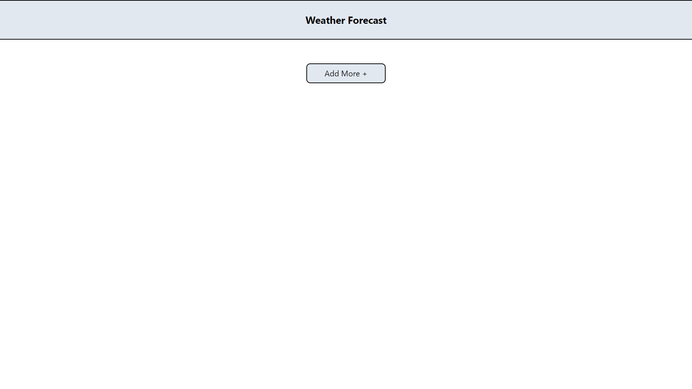

# weather-forecast-client
Client side for weather app including the API endpoints.

Steps:

Clone the repository on your system.

On terminal run "npm i" to install all the required packages.

Make sure to check the Weather Api Key in 'WeatherComponent.js' file is valid. (You can use yours if not working).

To start the app hit "npm start"

On first startup the app will look like:

Here you can add locations from the 'Add More +' button.

You can select location by clicking on any particular location buttons after adding.

After selection, weather forecast for the selected(highlighted) location will be rendered in four cards with current day, and three next days.

The added cities will be stored in session storage so will not vanish on page reload.

So to clear all the cities close the tab or restart the browser.

Thanks!
